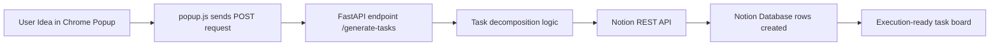

# Notion AI Task Generator


An end-to-end productivity workflow that turns raw ideas into execution-ready tasks and syncs them directly into Notion.

## 🚀 Hackathon Submission

### Seamless Execution Pipeline

Notion AI Task Generator is built around a **seamless execution pipeline**:

1. User enters a high-level idea in the Chrome Extension popup.
2. The extension sends that idea to a FastAPI backend.
3. The backend breaks the idea into clear, structured, actionable subtasks.
4. Tasks are pushed directly into a Notion Database using the Notion API.

This eliminates manual planning overhead by converting intent into organized action instantly, reducing context switching and helping users move from brainstorming to execution in seconds.

## 🧱 Project Structure

```text
.
├── main.py          # FastAPI backend + Notion API integration logic
├── manifest.json    # Chrome Extension Manifest V3 configuration
├── popup.html       # Extension popup UI
├── popup.js         # Popup behavior and API calls
├── style.css        # Popup styling
└── README.md        # Project documentation
```

## 🏗️ System Architecture



## 🛠️ Tech Stack

- **Frontend (Extension UI):** JavaScript, HTML, CSS
- **Backend API:** FastAPI (Python)
- **External Integration:** Notion REST API
- **Browser Platform:** Chrome Extension (Manifest V3)

## ⚙️ Setup Instructions

### 1. Clone the Repository

```bash
git clone https://github.com/Dhanush2200032764/chrome-ai-extension.git
cd chrome-ai-extension
```

### 2. Install Backend Dependencies

```bash
pip install fastapi uvicorn requests
```

### 3. Configure Environment Variables

Set your Notion credentials before running the backend:

```bash
export NOTION_API_KEY="your_notion_secret_token"
export NOTION_DATABASE_ID="your_notion_database_id"
```

If you are on Windows (PowerShell):

```powershell
$env:NOTION_API_KEY="your_notion_secret_token"
$env:NOTION_DATABASE_ID="your_notion_database_id"
```

### Security Note

- Never commit real Notion tokens or database IDs to source control.
- Keep secrets in environment variables or your cloud secret manager.

## 🔐 Notion Integration

To connect the app with your Notion workspace:

1. Create a Notion internal integration and copy the **Secret Token**.
2. Create or choose a Notion database and copy the **Database ID**.
3. Open your Notion database → **••• Menu** → **Connections**.
4. Add your created integration under **Connections** so it can access the database.

### Critical Requirement

The primary title column in your Notion database **must be named `Name`** for task creation to work correctly.

## ▶️ Execution

### 1. Start FastAPI Server

```bash
uvicorn main:app --reload
```

### 2. Load the Chrome Extension

1. Open `chrome://extensions/`
2. Enable **Developer mode**
3. Click **Load unpacked**
4. Select the project folder

## 🎬 Usage / Demo Flow

Example input in extension popup:

```text
Build AI Chrome Extension
```

Expected AI-generated task breakdown synced to Notion:

- 🔍 Research Chrome Extension architecture and APIs
- 🧠 Define AI workflow and task-generation logic
- 💻 Develop extension popup UI and request handling
- ⚙️ Implement FastAPI endpoints and processing pipeline
- 🔗 Integrate Notion API for task insertion
- ✅ Test end-to-end flow from idea to Notion sync

## 🔌 API Flow

### Endpoint

- Method: POST
- Route: /generate-tasks
- Content-Type: application/json

### Sample Request

```json
{
	"text": "Build AI Chrome Extension"
}
```

### Sample Response

```json
{
	"message": "Tasks added to Notion ✅",
	"tasks": [
		"🔍 Research requirements for Build AI Chrome Extension",
		"🧠 Design architecture for Build AI Chrome Extension",
		"💻 Develop core features",
		"🧪 Test and debug",
		"🚀 Deploy project"
	]
}
```

## 🧪 Judge Quick Validation

To verify the full pipeline in under one minute:

1. Run the backend with live reload.
2. Load the unpacked extension in Chrome.
3. Enter one project idea in the popup.
4. Submit and confirm new rows appear in Notion.
5. Validate the Name column contains the generated tasks.

## ☁️ Cloud Deployment

The FastAPI service can be deployed to any cloud platform that supports Python web services (for example: Render, Railway, Azure Web Apps, or AWS Elastic Beanstalk).

Recommended production start command:

```bash
uvicorn main:app --host 0.0.0.0 --port 8000
```

Deployment checklist:

- Set `NOTION_API_KEY` and `NOTION_DATABASE_ID` in your cloud environment variables.
- Restrict CORS origins to trusted frontend origins.
- Verify your Notion integration has database access via Connections.

## 📊 Final Status

| Module | Status |
|--------|--------|
| Backend (FastAPI) | ✅ Completed |
| Chrome Extension | ✅ Completed |
| Notion Integration | ✅ Completed |
| Cloud Deployment | ✅ Completed |

## 👤 Author

**Durga Dhanush Yaragani**  
B.Tech Final Year Student | Cloud & AI Enthusiast